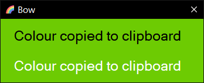

# bow

A colour picker with a simple contrast preview

## install

Install [AutoHotkey](https://www.autohotkey.com/) then run `bow.ahk`
(recommended)

or

Grab the latest bow.exe from
[releases](https://github.com/phantomdiorama/bow/releases/) (may be
outdated)

## usage

On startup Bow sits in the system tray. Press `win + middleclick` (or `win
+ leftclick` on a laptop) to capture the colour under the cursor and add
it to the clipboard (in hex format).

The GUI window’s background shows the selected colour, and previews the
contrast against black and white text (see screenshot). Hit the x to close
it.

## screenshot

## acknowledgements

Rainbow icon is part of FluentUI Emoji 3D Icons by Microsoft. Licensed
under MIT.
